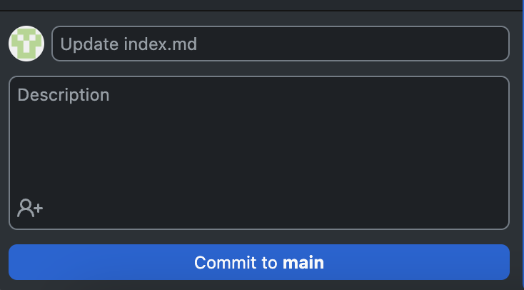

# Hosting an Online Website (Resume) using Etter's Modern Technical Writing Principles

## Purpose

The goal of this document is to use Andrew Etter's key principles spelled out in his book [*Modern Technical Writing*](https://www.amazon.ca/Modern-Technical-Writing-Introduction-Documentation-ebook/dp/B01A2QL9SS) to give a step-by-step tutorial on how to host a resume using GitHub Pages.

## Getting Started

These instructions will guide you through the process of hosting your resume on GitHub Pages as a static site. Note that this process was made with **MacOS** in mind. If you are using a different operating system the links provided may not be suitable for you. 

### Prerequisites

You must meet the following requirements:

- Have a [GitHub](https://docs.github.com/en/get-started/start-your-journey/creating-an-account-on-github) account.
- Have [GitHub Desktop](https://desktop.github.com) installed.
- Have a good understanding of how to write in Markdown.
    - Refer to these [additional resources](#More-Resources) if needed.
- Have a Markdown editor capable of rendering [GitHub Flavoured Markdown (GFM)](https://github.github.com/gfm/) or use an in-browser editor. I recommend either downloading the [Pine](https://lukakerr.github.io/Pine/) Markdown editor or using [StackEdit](https://stackedit.io/) which is an in-browser editor.
- Have a resume formatted in Markdown.

### Instructions

1. Create a new GitHub repository.

    - Using GitHub Desktop, create a new repository by navigating to File >> Create New Repository in the menu bar. Name your repository `[YourUsername].github.io`.
    - (Optional) You may choose to add a description for your repository.

        
  
    > "Distributed version control systems \[such as\] Git... \[provide\] better performance, allow for offline work, and are superior for concurrent work on the same file," - Etter.

2. [Commit](https://github.com/git-guides/git-commit) your resume to your local repository.

    - You should have a markdown-formatted resume. Make sure to rename it to `index.md` if it is not already. GitHub Pages looks for a file of that name when rendering the static site so you must name your file accordingly.
    - Click **Show in Finder** to open the local repository location and add your resume to the folder.
 
        

    - Next commit your file by clicking **Commit to main** at the bottom left of the GitHub Desktop application.

        

3. [Push](https://github.com/git-guides/git-push) changes to your remote repository.

    - Click **Push Origin** to commit your resume to the remote repository. Note that you may be prompted to [pull](https://github.com/git-guides/git-pull) commits from your remote repository before your push can go through. If that occurs first pull the remote changes into your local repository, then push your local changes to the remote repository. 

        

    - After completing this step your resume should be visible in your remote GitHub repository. You can view your repository by visiting `github.com/[YourUsername]/[YourRepositoryName]`.

4. Set up GitHub Pages.

    - Navigate to your remote repository by visiting `github.com/[YourUsername]/[YourRepositoryName]`.
    - Now you need to edit your repository settings to tell GitHub Pages which directory to render.
        - Navigate to the repository settings by pressing the *settings* button which is located in the navigation bar at the top of the page. This will direct you to a new page.
        - Navigate to the **Pages** tab under **Code and Automation**.
        - Once there, change the **Source** under **Build and deployment** to **Deploy from a branch**.
        - Below that, change the branch to `main` and folder to `/root`.
        - Finally, press **Save**.

        

    > According to Etter, static websites offer speed, simplicity, portability, security, and ease of hosting. GitHub Pages hosts static sites by using Jekyll as its static site generator, thus it follows one of the principles

5. Adding a theme to your GitHub Pages site using [Jekyll](https://jekyllrb.com).

    - First, you add a `_config.yml` file to your repository if one does not already exist. You can do this by clicking **Add file** then clicking on **Create new file**.

        

    - Now you should add the necessary information into your configuration file. Add the following lines of code to your `_config.yml` file and complete them by replacing the square bracketed parts with your own information. [Here](https://pages.github.com/themes/) is a resource which contains a list of supported GitHub Pages themes.
  
      ```yml
      title: [PageTitle]
      description: [PageDescription]
      theme: [ChosenTheme]
      ```
      
    - Note if you do not include the description field the repository description you could have optionally chosen to set in step 1 will be used as your resume description.
    
6. Your resume should be hosted.
    
    - You can view your resume at `https://[RepositoryName]`. Note this will only work if your repository is properly named with the schema `[YourUsername].github.io`.

        

After completing this step-by-step tutorial you should have a working static website of your Markdown resume hosted by GitHub Pages! 
Congrats! 🥳

## More Resources

- Markdown
    - [Tutorial](https://www.markdowntutorial.com)
    - [Cheatsheet](https://www.markdownguide.org/cheat-sheet/)
    - [Basic Syntax](https://docs.github.com/en/get-started/writing-on-github/getting-started-with-writing-and-formatting-on-github/basic-writing-and-formatting-syntax)

## Authors & Acknowledgements

- **Billie Thompson** - *Provided README Template* - [PurpleBooth](https://github.com/PurpleBooth)

- [Casual-markdown-cv](https://github.com/casualwriter/casual-markdown-cv/blob/main/resume.md) - *Provided Resume Template*
- A special thank you to Saida Sonan and Yuze Chen for their help during the peer review process!

## FAQ

### Q: Why is markdown better than a word processor?

A: Markdown's simple and intuitive syntax make it extremely readable for most individuals. Since Markdown files are plain text files, they are compatible with version control systems like Git. Also, it is a very portable language as it can be opened and edited with any text editor and can be converted to a number of other popular formats using software such as [Pandoc](https://pandoc.org).

### Q: Why is my resume not showing up?

Check the following:
- Make sure your repository is named following the schema `[YourUsername].github.io`.
- Make sure your resume file is named `index.md`.
- Make sure your repository settings were properly set in step 4.
