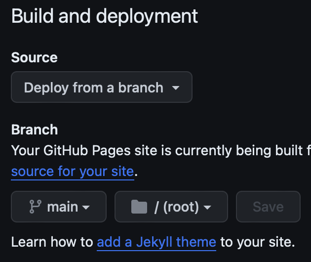

# Hosting an Online Website (Resume) using Etter's Modern Technical Writing Principles

## Purpose

The goal of this document is to describes the practical steps necessary to host a resume using Github Pages with related discussion around Andrew Etter's key principles found in his book [*Modern Technical Writing*](https://www.amazon.ca/Modern-Technical-Writing-Introduction-Documentation-ebook/dp/B01A2QL9SS).

## Getting Started

These instructions will guide you through the process of hosting your resume on Github Pages as a static site. Note that this process was made with MacOS in mind. If you are using a different operating system the links provided may not be suitable for you. 

### Prerequisites

You must meet the following requirements:

- Have a [Github](https://docs.github.com/en/get-started/start-your-journey/creating-an-account-on-github) account.
- Have [Github Desktop](https://desktop.github.com) installed.
- Have a good understanding of Markdown including how to write in Markdown.
    - Refer to these [additional resources](#More-Resources) if needed.
- Have a Markdown editor capable of rendering [GitHub Flavoured Markdown (GFM)](https://github.github.com/gfm/) or use an in-browser editor. I recommend either downloading the [Pine](https://lukakerr.github.io/Pine/) Markdown editor or using [StackEdit](https://stackedit.io/) which is an in-browser editor.
- Have a resume formatted in Markdown.

### Instructions

1. Create a new Github repository.

- Using Github Desktop, create a new repository by navigating to the menu bar >> File >> Create New Repository. Name your repository `[YourUsername].github.io`.
- (Optional) You may choose to add a description for your repository.

  
  
> "Distributed version control systems \[such as\] Git... \[provide\] better performance, allow for offline work, and are superior for concurrent work on the same file," - Etter.

2. [Commit](https://github.com/git-guides/git-commit) your resume to your repository.

- You should have a markdwon-formatted resume. Make sure to rename it to `index.md` since Github pages looks for a file of that name when rendering the static site.
- Use *Show in Finder* an add your resume to the folder.
 
    

- Next commit your file using the *Commit to main** at the bottom left of the application.

    

3. [Push](https://github.com/git-guides/git-push) to remote repository.

- Press the *Push Origin* button to commit your resume to the remote repository. Note that you may be prompted to [*pull*](https://github.com/git-guides/git-pull) commits from your remote repository before your push can go through. Proceed to pull the remote changes followed by pushing your changes.  

    

- After completing this step your resume should be visible in your remote Github repository. You can view your repository by visiting `github.com/[YourUsername]/[YourRepositoryName]`.

4. Set up Github Pages

- Navigate to your repository by visiting `github.com/[YourUsername]/[YourRepositoryName]`.
- Now we need to change our repository settings to tell Github Pages which directory to render.
    - Navigate to the repository settings by pressing the *settings* button which is located in the navigation bar at the top of the page. This will direct you to a new page.
    - Navigate to the 'Pages' tab under 'Code and Automation'.
    - Once there, change the 'Source' under 'Build and deployment' to 'Deploy from a branch'.
    - Change the branch to `main`, folder to `/root`, and finally press 'save'.

## More Resources

- Markdown
    - [Tutorial](https://www.markdowntutorial.com)
    - [Cheatsheet](https://www.markdownguide.org/cheat-sheet/)
    - [Basic Syntax](https://docs.github.com/en/get-started/writing-on-github/getting-started-with-writing-and-formatting-on-github/basic-writing-and-formatting-syntax)

## Authors & Acknowledgements

- **Billie Thompson** - *Provided README Template* - [PurpleBooth](https://github.com/PurpleBooth)

## FAQ

### Q: Why is markdown better than a word processor?

A: Because it is :)

### Q: Why is my resume not showing up?

A: Idk 🤷‍♂️

^^ Will replace with serious answers ^^
